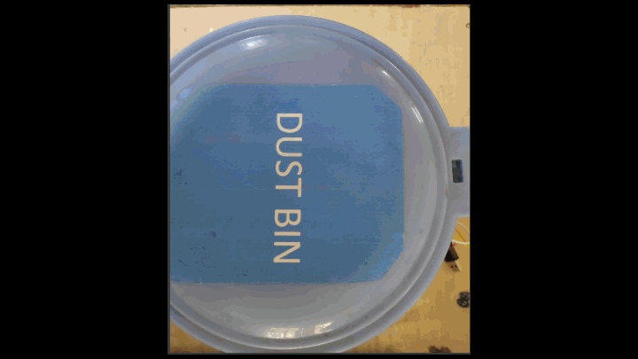
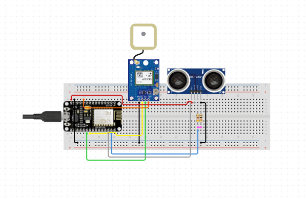
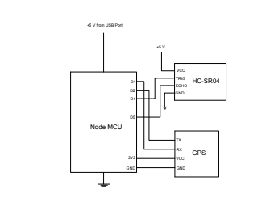
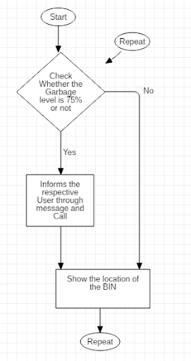
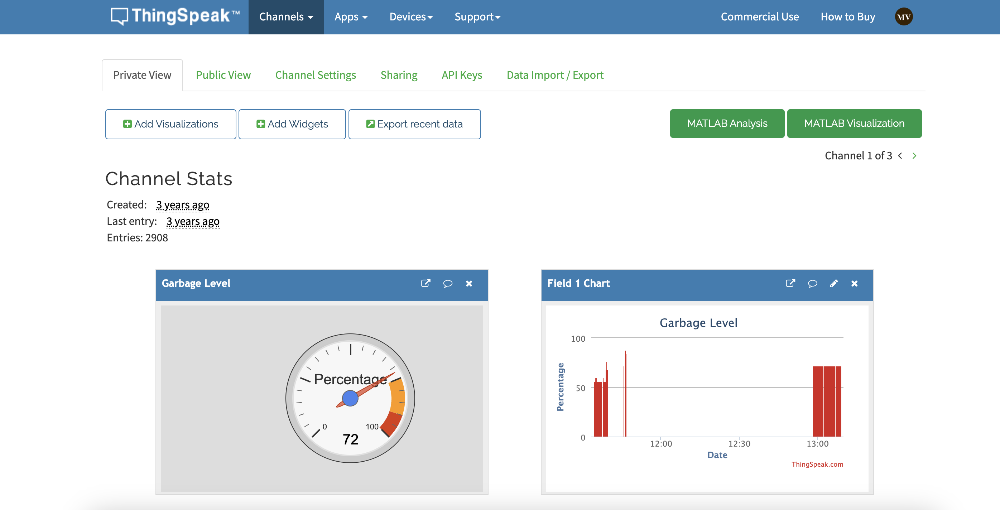
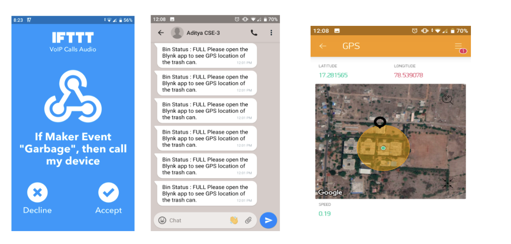

<h1 align="center"> Garbage Monitoring and Collection Assistance</h1>  

  

  An effective IoT based waste management solution

<!-- START doctoc generated TOC please keep comment here to allow auto update -->
<!-- DON'T EDIT THIS SECTION, INSTEAD RE-RUN doctoc TO UPDATE -->
## Table of Contents

- [About the Project](#about-the-project)
- [Circuit Design](#circuit-design)
- [Implementation](#implementation)
- [Results](#results)
- [Contributing](#contributing)

<!-- END doctoc generated TOC please keep comment here to allow auto update -->

## About the Project

India generates 62 million tonnes of waste annually, of which less than 60% is collected and around 15% processed. With landfills ranking third in terms of greenhouse gas emissions in India, and increasing pressure from the public, the Government of India revised the Solid Waste Management after 16 years. The processing of garbage involves carrying garbage from one place to another through trucks and cranes. Nowadays, waste collection is inefficiently performed using static routes and schedules. 

  

An effective IoT-based waste management solution can be implemented to avoid such situations. The dustbins are interfaced with an ultrasonic sensor and a central system showing the current garbage status on the Thingspeak server and displaying the GPS coordinates on the Blynk app. Using this system, the garbage level in the dustbins can be monitored constantly, placed in various parts of the city. If a particular dustbin has reached the maximum level, then the sanitation department can be informed, and they can immediately take specific actions to empty it as soon as possible. The employees can check the status of these bins anytime on their mobile phones. Moreover, the data stored on the server can be used to optimize the waste collection routes, thereby reducing human efforts, fuel, and time. The system can be used as a benchmark to enhance a SMART CITY vision.

## Circuit Design

  

  

## Implementation

  

An Ultrasonic Sensor is used to detect whether the trash can is filled with garbage. Here the sensor is installed at the top of the trash can and will measure the distance of waste from the top of the trash can, and a threshold value set according to the trash can size. If the length exceeds this threshold value, the trash can is full of garbage, and can be notified accordingly via webhooks. The data collected from the sensor is transferred to the Thingspeak Server via NodeMCU wifi module.  The live GPS coordinates of the bin are displayed in the Blynk app. 

## Results

The Thingspeak platform displays the garbage level in the bin graphically and digitally.

  

Notification regarding the garbage is implemented using IFTTT platform.

  

The technologies which are used in the proposed system are good enough to ensure the practical and perfect for solid garbage collection process monitoring and management for green environment. 

## Contributing

Contributions are what make the open source community such an amazing place to be learn, inspire, and create. Any contributions you make are **greatly appreciated**.

1. Fork the Project
2. Create your Feature Branch (`git checkout -b feature/AmazingFeature`)
3. Commit your Changes (`git commit -m 'Add some AmazingFeature'`)
4. Push to the Branch (`git push origin feature/AmazingFeature`)
5. Open a Pull Request

Pull requests are welcome. For major changes, please open an issue first to discuss what you would like to change.

